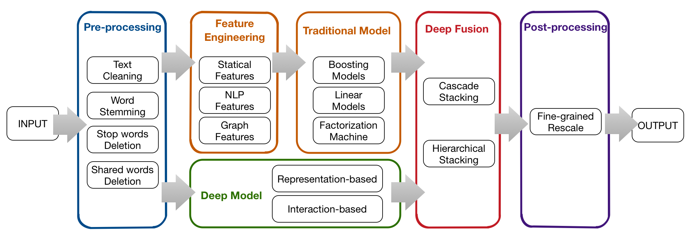

****

#	
Kaggle: Quora Question Pairs (Comming Soon)

##### 
Author: Liang Pang, Yixing Fan, Jianpeng Hou, Xinyu Yue, Guocheng Niu

****

##	Categories
*	[Abstract](#abstract)
* 	[Summary](#summary)

****

##	<a name="abstract"> Abstract </a>

In the Quora Question Pairs Challenge, we were asked to build a model to classify whether question pairs are duplicates or not (multiple versions of the same question). Our final submission was a stacking result of multiple models. This submission scored **0.11450** on Public LB and **0.11768** on Private LB (with post-process), ranking **4** out of **3396** teams. This documents describes our team's solution which can be divided into diffrent parts: Pre-processing, Feature Engineering, Modeling and Post-processing.

****

##	<a name="summary"> Summary </a>

Our solution consisted of four main parts: Pre-processing, Feature Engineering, Modeling and Post-processing. What's more, we developed a light weight Machine Learning framework **FeatWheel** to help us to finish ML jobs, such as feature extraction, feature merging and so on.

In pre-processing, we process the text of data with text cleaning, word stemming, removing stop words and shared words and can form different versions of original data. In feature engineering, we extracted features based on various versions of data. The features can be classified in to three categories：Statistical Features, NLP Features and Graph Features. In modeling, we build deep models, boosting models (using XGBoost, LightGBM) and linear models (Linear Regression) and build a multi-layer stacking system to ensemble different models together. As we all know, the distribution of the training data and test data are quite different, so we made post-processing on the prediction results. We cut the data into different parts according to the clique size and rescale the results in different parts. 

###	Flowchart

The flowchart of our method is shown as follows:

###	Submission

Submissions were evaluated on the log loss between the predicted values and the group truth. In specific, the best single model we have obtained during the competition was an XGBoost model with tree booster of Public LB score **0.12653** and Private LB score **0.13067** (without post-process). Our final submission was a stacking result of multiple models. This submission scored **0.11450** on Public LB and **0.11768** on Private LB (with post-process), ranking **4** out of **3396** teams.

****

### Deep Model

Please see [TextNet](https://github.com/pl8787/textnet-release) and [TextNet-Model](https://github.com/pl8787/textnet-model). For tensorflow version, please checkout [MatchZoo](https://github.com/faneshion/MatchZoo).
